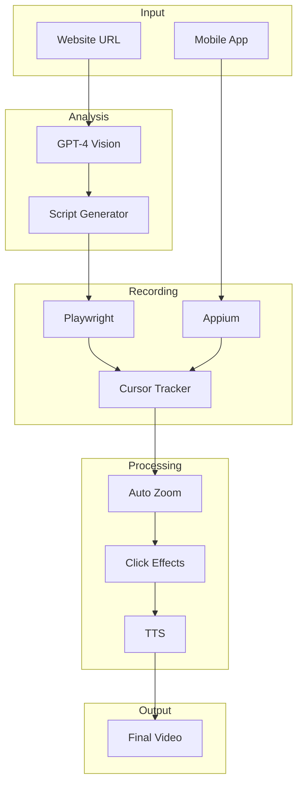

# Advanced Topics

Deep-dive into LooK's advanced features and architecture.

## Advanced Guides

<div class="grid cards" markdown>

-   :material-brain:{ .lg .middle } __Intelligent Exploration__

    ---

    How LooK's AI discovers and navigates your site automatically.

    [:octicons-arrow-right-24: Intelligent Exploration](intelligent-exploration.md)

-   :material-robot:{ .lg .middle } __AI Enhancements__

    ---

    Understanding LooK's AI-powered features and customization.

    [:octicons-arrow-right-24: AI Enhancements](ai-enhancements.md)

-   :material-sitemap:{ .lg .middle } __Architecture__

    ---

    Technical architecture and system design of LooK.

    [:octicons-arrow-right-24: Architecture](architecture.md)

-   :material-code-braces:{ .lg .middle } __API Integration__

    ---

    Integrate LooK into your CI/CD pipeline and applications.

    [:octicons-arrow-right-24: API Integration](api-integration.md)

</div>

## When to Use Advanced Features

### Intelligent Exploration

Use when:

- You want LooK to automatically discover all pages
- Creating comprehensive site walkthroughs
- Letting AI decide what's most important to show

```bash
look walkthrough https://myapp.com --max-pages 10
```

### AI Enhancements

Use when:

- Customizing AI analysis behavior
- Adjusting script generation prompts
- Fine-tuning voiceover timing

### API Integration

Use when:

- Automating demo generation in CI/CD
- Building tools on top of LooK
- Creating custom workflows

```javascript
import { generateDemo } from 'look-demo';

// Automated demo generation
await generateDemo(url, options);
```

## Architecture Overview



## Performance Considerations

### Memory Usage

- Default recording uses ~2GB RAM
- Long recordings (>60s) may need more
- Use `NODE_OPTIONS="--max-old-space-size=8192"` for large projects

### Disk Space

- Temporary files: ~500MB per recording
- Project files: ~100MB per project
- Clean up with `rm -rf ~/.look-demo/cache/*`

### API Costs

| Feature | Approximate Cost |
|---------|------------------|
| GPT-4 Vision analysis | $0.01-0.03 |
| Script generation | $0.005-0.01 |
| TTS voiceover | $0.015 per 1K chars |
| **Typical demo** | **$0.05-0.10** |
