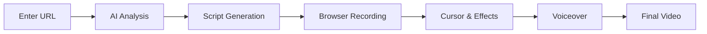

# L👀K Documentation

<div class="hero" markdown>

# L👀K

**One command. Professional product demo videos.**

Turn any website into a polished demo video with AI-generated voiceover. No editing required.

[Get Started](getting-started/index.md){ .md-button .md-button--primary }
[View on GitHub](https://github.com/nirholas/LooK){ .md-button }

</div>

---

## What is LooK?

LooK is an AI-powered tool that automatically generates professional product demo videos from any website. It captures your site, analyzes the UI with GPT-4 Vision, writes a compelling script, adds smooth cursor animations, and produces a polished video with AI voiceover.

```bash
npx look-demo quick https://your-app.com
```

That's it. You get a professional demo video in minutes.

## ✨ Features

<div class="grid cards" markdown>

-   :material-video-box:{ .lg .middle } __Smart Recording__

    ---

    60fps browser capture with smooth cursor animations and intelligent zoom that follows user interactions.

-   :material-robot:{ .lg .middle } __AI Analysis__

    ---

    GPT-4 Vision understands your UI, identifies key features, and generates compelling voiceover scripts.

-   :material-microphone:{ .lg .middle } __Natural Voice__

    ---

    Choose from 6 natural-sounding AI voices to narrate your demo professionally.

-   :material-cursor-default-click:{ .lg .middle } __Click Effects__

    ---

    Beautiful ripple, pulse, ring, and spotlight animations highlight user interactions.

-   :material-cellphone:{ .lg .middle } __Mobile Support__

    ---

    Record iOS and Android app demos with device frames and touch indicators.

-   :material-export:{ .lg .middle } __Multi-Platform Export__

    ---

    Export optimized for YouTube, Twitter, Instagram, TikTok, or as animated GIFs.

</div>

## Quick Example

=== "CLI"

    ```bash
    # Quick demo with smart defaults
    look quick https://stripe.com

    # Full control
    look demo https://myapp.com \
      --duration 30 \
      --voice nova \
      --zoom-mode smart
    ```

=== "Web Editor"

    ```bash
    # Start the visual editor
    look serve

    # Opens http://localhost:3847 with:
    # - Visual timeline editing
    # - Live recording preview
    # - Template library
    # - Script editor
    ```

=== "Node.js"

    ```javascript
    import { generateDemo } from 'look-demo';

    await generateDemo('https://myapp.com', {
      output: './demo.mp4',
      duration: 30,
      voice: 'nova',
      style: 'professional'
    });
    ```

## How It Works



1. **Capture** - Record your website with smooth cursor animations
2. **Analyze** - GPT-4 Vision understands your UI and content
3. **Script** - AI writes a compelling voiceover script
4. **Narrate** - Natural AI voice brings the demo to life
5. **Export** - Polished video ready for any platform

## Requirements

- **Node.js 18+**
- **FFmpeg** - `brew install ffmpeg` (Mac) or `apt install ffmpeg` (Linux)
- **OpenAI API Key** - For AI features ([Get one here](https://platform.openai.com/api-keys))

## Installation

```bash
npm install -g look-demo
```

[Continue to Getting Started →](getting-started/index.md){ .md-button }

---

## Community

- :fontawesome-brands-github: [GitHub Repository](https://github.com/nirholas/LooK)
- :fontawesome-solid-bug: [Report Issues](https://github.com/nirholas/LooK/issues)
- :fontawesome-solid-book: [Documentation](https://nirholas.github.io/LooK/)

## License

LooK is [MIT licensed](https://github.com/nirholas/LooK/blob/main/LICENSE).
